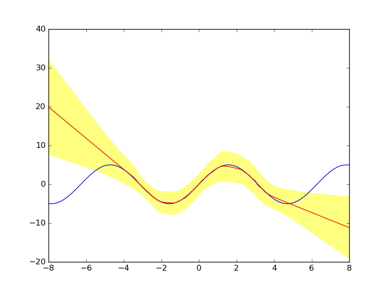
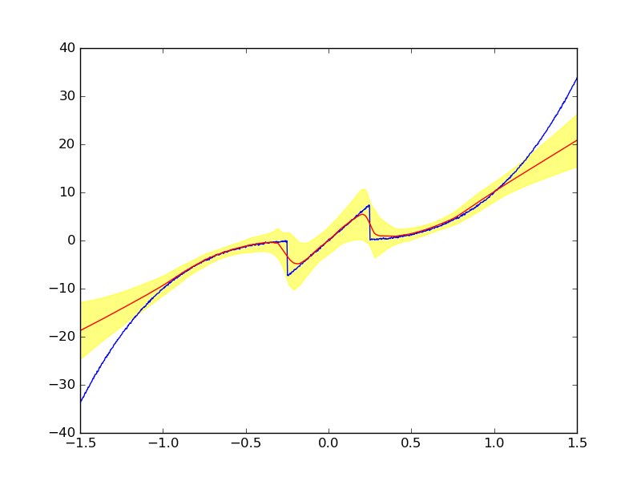

# Description

Implementation of the [paper](https://arxiv.org/pdf/1612.01474v1.pdf) **Simple and Scalable Predictive Uncertainty Estimation using Deep Ensembles**

Predictive uncertainty estimates obtained by using the ensemble approach proposed in the paper. The value of the sinusoidal function for values between -4 and 4 was used in training and at test time, the trained model is used to predict function values between -8 and 8. The blue line represents the true function, red represents the mean and the other two curves represent (mean + 3*std)

Predictive uncertainty estimates obtained by using a dropout Gaussian regressor. During training, we train the model to minimize NLL with dropout. Hence, as a result, a larger (theoretically, infinite) ensemble of networks are trained simultaneously. At test time, we maintain the same dropout and average the predictions of a fixed number (in the above plot, 50) of networks that are part of the trained ensemble.

I also tried out the kink example given in the paper by breaking the cubic curve in the middle and introducing a kink (sinusoidal curve)

The implementation is partly inspired from [this](https://github.com/muupan/deep-ensemble-uncertainty) repository

**Author** : Anirudh Vemula
